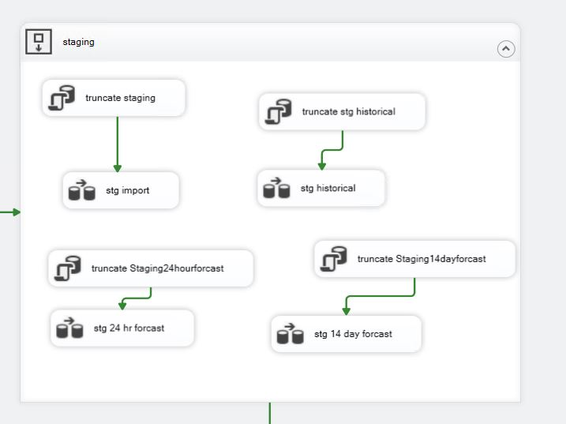
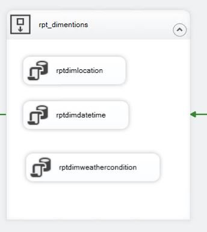
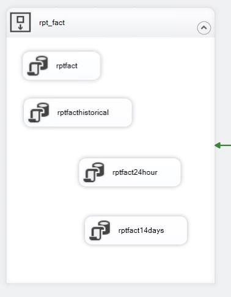

# WeatherDataPipeline

**WeatherDataPipeline** is an end-to-end ETL project that automates the process of extracting weather data from an API, transforming it, and loading it into SQL Server for reporting and visualization in Power BI. This repository demonstrates how to integrate Python, SSIS, SQL Server, and Power BI into one seamless data pipeline.

-----

## Table of Contents

  - [Overview](https://www.google.com/search?q=%23overview)
  - [Repository Structure](https://www.google.com/search?q=%23repository-structure)
  - [Installation & Setup](https://www.google.com/search?q=%23installation--setup)
      - [Database Setup](https://www.google.com/search?q=%23database-setup)
      - [SSIS Package Deployment](https://www.google.com/search?q=%23ssis-package-deployment)
      - [Python Scripts Configuration](https://www.google.com/search?q=%23python-scripts-configuration)
      - [Power BI Dashboard](https://www.google.com/search?q=%23power-bi-dashboard)
  - [ETL Workflow](https://www.google.com/search?q=%23etl-workflow)
      - [SSIS Package Blocks](https://www.google.com/search?q=%23ssis-package-blocks)
      - [Python Integration](https://www.google.com/search?q=%23python-integration)
  - [Configuration Checklist](https://www.google.com/search?q=%23configuration-checklist)
  - [Usage](https://www.google.com/search?q=%23usage)
  - [Contributing](https://www.google.com/search?q=%23contributing)
  - [License](https://www.google.com/search?q=%23license)
  - [Acknowledgements](https://www.google.com/search?q=%23acknowledgements)

-----

## Overview

This project implements an automated, end-to-end **Extract, Transform, Load (ETL)** data pipeline for weather information. The core workflow involves:

1.  **Data Extraction:** Orchestrated by the SSIS package, Python scripts fetch four distinct categories of weather data from the OpenWeatherMap API:
    * **Real-time weather conditions**
    * **24-hour hourly forecasts**
    * **14-day daily forecasts**
    * **Historical hourly observations**
    This extracted data is then processed and saved into separate CSV files.
2.  **Data Loading & Transformation (ETL via SSIS):** The SSIS package continues to orchestrate the loading of these CSV files into a SQL Server database. Within SSIS, data undergoes cleaning, transformation, and integration into a structured star schema (staging, dimension, and fact tables) for analytical purposes.
3.  **Data Reporting & Visualization:** The processed and organized data in SQL Server is then connected to a Power BI dashboard, enabling interactive reporting and insightful visualizations of current conditions, historical trends, and future forecasts.

This pipeline ensures fresh weather data is regularly available for analysis, providing a comprehensive view of weather patterns and their potential impacts.

-----

## Repository Structure

```
WeatherDataPipeline/
├── Documentation/
│   ├── delete csv.JPG
│   ├── dimensions builds.JPG
│   ├── fact builds.JPG
│   ├── get realtime data.JPG
│   ├── rpt_dimensions.JPG
│   ├── rpt_facts.JPG
│   ├── ssis package.JPG
│   ├── ssms data model.JPG
│   └── staging.JPG
├── powerbi files/
│   └── weatherdata.pbix
├── python scripts/
│   ├── 14_day_forecast.py
│   ├── 24_hour_forecast.py
│   ├── fetch_real_time_data.py
│   ├── historical_hourly_data.py
│   └── requirements.txt
├── sql scripts/
│   ├── dimdatetime.sql
│   ├── dimlocation.sql
│   ├── dimweathercondition.sql
│   ├── fact14daysforecastdaily.sql
│   ├── fact24hourforecast.sql
│   ├── facthistoricalhourly.sql
│   ├── factrealtime.sql
│   ├── schemas.sql
│   ├── stg14daysforecastdaily.sql
│   ├── stg24hrforecasthourly.sql
│   ├── stghistoricalhourly.sql
│   └── stgrealtimeweather.sql
├── ssis package/
│   ├── Package.dtsx
│   ├── weatherdata2.dtproj
│   ├── weatherdata2.dtproj.user
│   └── weatherdata2.sln
└── README.md
```


-   **Documentation:** Includes detailed images of the SSIS package components, database diagrams, and various Power BI dashboard screenshots for different analysis pages.
-   **powerbi files:** Contains the Power BI dashboard file for data visualization.
-   **python scripts:** Contains the Python code for fetching data from the weather API and converting JSON responses to CSV format.
-   **sql scripts:** Contains SQL scripts to create schemas, staging, dimension, and fact tables.
-   **ssis package:** Contains the SSIS package (`Package.dtsx`) and related project files that automate the ETL process.

---

## Installation & Setup

### Database Setup

1.  **SQL Server:**
    * Ensure you have a running SQL Server instance.
    * Open SQL Server Management Studio (SSMS) and execute the SQL scripts in the following order:
        1.  `schemas.sql`
        2.  `stgrealtimeweather.sql` (and other `stg` scripts as applicable for initial staging)
        3.  `dimdatetime.sql`, `dimlocation.sql`, `dimweathercondition.sql` (and other `dim` scripts)
        4.  `factrealtime.sql`, `fact14daysforecastdaily.sql`, `fact24hourforecast.sql`, `facthistoricalhourly.sql` (and other `fact` scripts)
    * Verify the `USE [weatherdata]` directive and adjust if your database has a different name.

### SSIS Package Deployment

1.  **Open the Project in Visual Studio:**
    * Launch Visual Studio with SQL Server Data Tools (SSDT) installed.
    * Open the SSIS project (`weatherdata2.sln`) containing the `Package.dtsx` package.
2.  **Deploy the Package:**
    * Right-click on the SSIS project (`weatherdata2` in Visual Studio's Solution Explorer) and select **Deploy**.
    * Follow the Integration Services Deployment Wizard to specify the target SQL Server instance and destination (usually the `SSISDB` catalog).
3.  **Verify in SSMS:**
    * Open SSMS and connect to your SQL Server.
    * Expand **Integration Services Catalogs > SSISDB** to locate and verify your deployed package.

### Python Scripts Configuration

1.  **Environment Setup:**
    * Navigate to the `python scripts` folder.
    * Create and activate a virtual environment:
        * **Windows:**
            ```bash
            python -m venv venv
            venv\Scripts\activate
            ```
        * **macOS/Linux:**
            ```bash
            python3 -m venv venv
            source venv/bin/activate
            ```
2.  **Install Dependencies:**
    * Install the required Python libraries using pip:
    ```bash
    pip install pandas requests
    ```
3.  **Configure Python Scripts:**
    * Update **API keys**, **endpoints**, and any other parameters in the Python scripts (e.g., `fetch_real_time_data.py`, `14_day_forecast.py`, etc.). **For security best practices, consider using environment variables or a separate configuration file (not committed to version control) for sensitive information like API keys, rather than hardcoding them directly in the scripts.**
    * Ensure that the Python scripts write the generated CSV files to the directory expected by SSIS.

### Power BI Dashboard

1.  Open the `weatherdata.pbix` file in Power BI Desktop.
2.  Configure the data source connection(s) to point to your SQL Server.
3.  Refresh the dataset to visualize the latest weather insights.
4.  Interact with the dashboard to explore detailed weather trends.

#### Dashboard Pages and Insights:

The `weatherdata.pbix` dashboard features several interactive pages to provide comprehensive weather analysis:

* **Introduction Page:** A welcome page setting the stage for the "Real-time Weather Analysis" presented by Sandeep Mondkar.
* **Current Weather Page:** Displays real-time weather conditions for a selected city (e.g., Halifax). Key metrics include Current Temperature (°C), "Feels Like" temperature, Humidity, Weather Condition (e.g., "broken clouds"), Wind Speed, Wind Direction, and Last Recorded Time.
* **Trend Analysis Page:** Provides visualizations for temperature forecasts: "Last 24-Hour Temperature Forecast" showing historical temperature trends; "Next 24-Hour Temperature Forecast" projecting immediate future temperature changes; "14-Day Temperature Forecast" for long-term temperature outlook. Includes a city selector to view trends for different locations.
* **What Affects Temperature? Page:** Utilizes a decomposition tree or similar visual to break down temperature variations based on factors like City, Humidity, Weather condition, and Wind Speed. This page helps in understanding the drivers behind observed temperature differences.
* **Q&A Page:** Features a "Temperature Distribution Across Cities" map, visually representing temperature patterns across North America. Includes a Q&A visual or card, allowing for natural language queries to explore data, such as the "Sum of TemperatureCelsius" for a specific city.
* **Conclusion Page:** Summarizes key findings from the analysis: Real-time conditions vary significantly (e.g., Toronto/Vancouver mild, Edmonton/Regina colder); Rapid temperature fluctuations are noted in some regions, influenced by wind patterns and humidity; Upcoming weather shows stable temperatures in some areas, with increased wind activity and possible precipitation in others; Long-term forecasts reveal warmer conditions in southern regions and colder trends in the north; Humidity and wind speed play a crucial role in temperature variations, with strong winds often linked to sudden temperature drops.

---

## ETL Workflow

### SSIS Package Blocks

The SSIS package (`Package.dtsx`) is structured into 7 key blocks:

1.  **Delete CSV Files:** Deletes all existing CSV files to ensure that the data ingestion starts fresh.
    
2.  **Get Real-time Data:** Executes Python scripts that fetch weather data from the API, convert JSON responses to CSV format, and save them in a specified directory.
    
3.  **Staging:** Truncates existing staging tables in SQL Server, loads the new CSV data into the staging tables, and drops existing views to prepare for fresh data transformations.
    
4.  **Dimension Build:** Extracts and processes data from the staging tables to build and populate dimension tables.
    
5.  **Fact Build:** Truncates existing fact tables, then extracts and processes data from staging tables to build and populate fact tables.
    
6.  **Reporting Dimensions (rpt_dims):** Creates views for each dimension table to simplify reporting.
    
7.  **Reporting Facts (rpt_fact):** Creates views for each fact table to be used in Power BI for interactive reporting.
    

**Overall SSIS Package Flow:**


### Python Integration

* **Data Retrieval:** The Python scripts (`14_day_forecast.py`, `24_hour_forecast.py`, `fetch_real_time_data.py`, `historical_hourly_data.py`) are responsible for fetching weather data from an external API (OpenWeatherMap), converting JSON responses into CSV files, and saving the CSV files to a designated directory where SSIS can access them.
* **Workflow Coordination:** The SSIS package first deletes any existing CSV files, then triggers the Python scripts. Once the new CSV files are generated, SSIS loads the data into SQL Server, processes it, and creates views for reporting.

**Database Model:**


---

## Configuration Checklist

Before running the pipeline, ensure the following:

* **File Paths:** Verify that the file paths for CSV generation (in Python) and CSV access (in SSIS) match.
* **Python Script Settings:**
    * Ensure API keys, endpoints, and parameters are correctly configured within your Python scripts.
    * Confirm that the output CSV directory is correctly set in the script.
* **SSIS Connection Managers:**
    * Check that the OLE DB Connection Manager in your SSIS package is configured to connect to your SQL Server.
    * Ensure Flat File Connection Managers point to the correct CSV files generated by Python.
    * Adjust any other connection configuration settings as needed.
* **Permissions:**
    * Ensure that the SSIS package has the necessary read/write permissions to access the CSV directory.
    * Confirm SQL Server permissions allow for data insertion and truncation in the staging, dimension, and fact tables.

---

## Usage

1.  **Set Up the Environment:**
    * Upload all necessary files to your GitHub repository, matching the structure outlined in this README.
    * Run the SQL scripts in SSMS to set up the database.
    * Deploy the SSIS package from Visual Studio to SSMS.
    * Configure and run the Python scripts to fetch and save weather data as CSV files.
2.  **Execute the Pipeline:**
    * The SSIS package will first delete existing CSV files, then trigger the Python scripts, insert new data into staging, build dimensions and facts, and finally create reporting views.
    * Open the Power BI dashboard to view the processed data.
3.  **Monitor & Troubleshoot:**
    * Check logs in SSIS for any errors during deployment or execution.
    * Verify CSV generation and database updates if issues arise.

---

## Contributing

Contributions are welcome! To contribute:

1.  Fork the repository.
2.  Create a new branch for your feature or bug fix:
    ```bash
    git checkout -b feature/your-feature-name
    ```
3.  Commit your changes with clear messages.
4.  Push to your branch and submit a pull request.
5.  Follow the repository’s guidelines regarding code style and testing.

---

## License

This project is licensed under the [MIT License](LICENSE).

---

## Acknowledgements

* Thanks to the open-source community for the tools and resources that made this project possible.
* Special thanks to the developers of SQL Server, SSIS, Python, and Power BI.
* Appreciation to the weather API providers for reliable data access (specifically, **OpenWeatherMap**).

---
